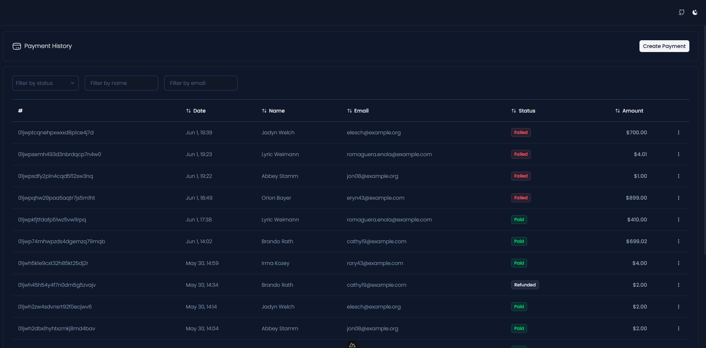

<h1 align="center">Full Stack Laravel and Vue.js Dashboard Implementation</h1>

This is a full stack implementation of a dashboard using laravel and vue.js

## Project made by [João Augusto](https://github.com/joaoaugustojr) for [Curotec](https://talent.curotec.com/candidate)

Follow the instructions below to get started with the project.

## Installation

1. Backend - [README.md](https://github.com/joaoaugustojr/data-management-dashboard/blob/main/data-management-api/README.md)
2. Frontend - [README.md](https://github.com/joaoaugustojr/data-management-dashboard/blob/main/data-management-front/README.md)

## 📊 Project Overview

This project is a **simple yet scalable dashboard** designed to manage a list of payments. It allows users to:

- Create, edit, and delete payment records  
- Filter results in real time with multiple combined conditions  
- Interact with a highly responsive and optimized frontend

To ensure performance and scalability, the system leverages **Redis for caching** and implements **frontend techniques** to reduce unnecessary API calls.

---

## 🔮 Future Plans

Planned enhancements include:

- A complete **admin dashboard** with authentication  
- Additional test coverage for new features and modules  
- **Scheduled tasks** to automatically update payment statuses based on due dates  
- Continuous improvements in **UX and UI navigation**

## 🙏 Acknowledgments

I would like to thank the entire talented team at **Curotec** for their support, feedback, and inspiration throughout this project.